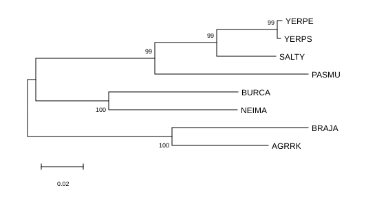
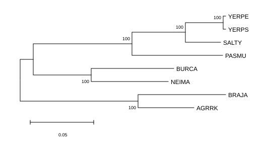
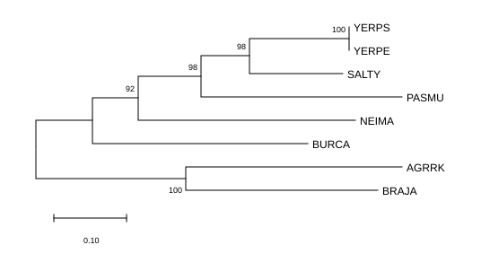
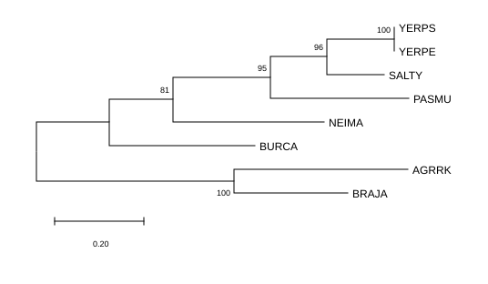

# Домашнее задание 1

Провести MSA и построить дерево с помощью NJ и ML алгоритмов для:

- 16s РНК
- peptidyl-trna-hydrolase

Ответить на вопросы:

- В чем разница между полученными деревьями?
- Какое из них точнее показывает эволюцию бактерий

## MSA

Выполним  в MEGA с помощью CluscalW

## Построение деревьев

Standart Bootstrap - 500 репликаций

## Подумаем

Видно, что топологии 16s и Peptidyl-tRNA hydrolase деревьев незначительно отличаются (положение NEIMA по отношению к BURCA и кладе YERPS, YERPE, SALTY, PASMU). 

Бутстрепы на дереве с 16s РНК более высокие, то есть топология более стабильна. Я думаю, что это связано с тем, что 16s РНК является некодирующей и довольно консервативна. Она эволюционирует медленно и равномерно.

А Peptidyl-tRNA hydrolase - это белок-кодирующий ген. Из-за давления ествественного отбора и горизонтального переноса генов в нем эволюция идет активнее и может быть разной для разных линий бактерий.

Поэтому дерево 16S точнее показывает эволюцию бактерий (здесь NJ и ML почти не отличаются). 